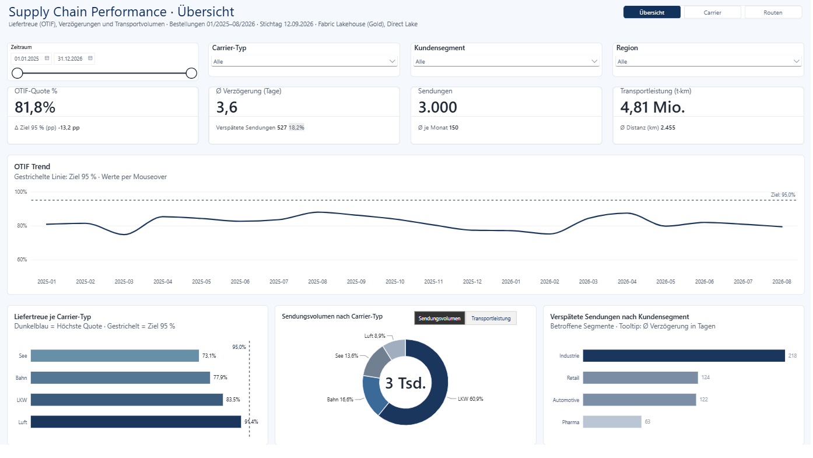
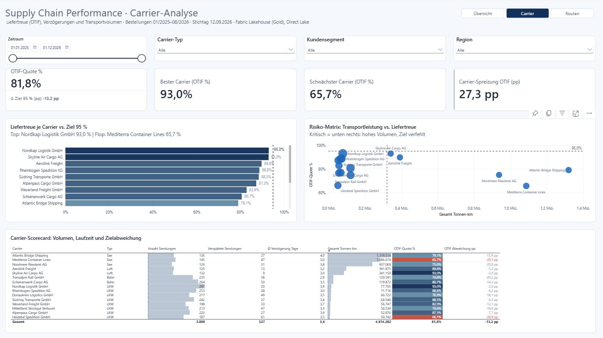
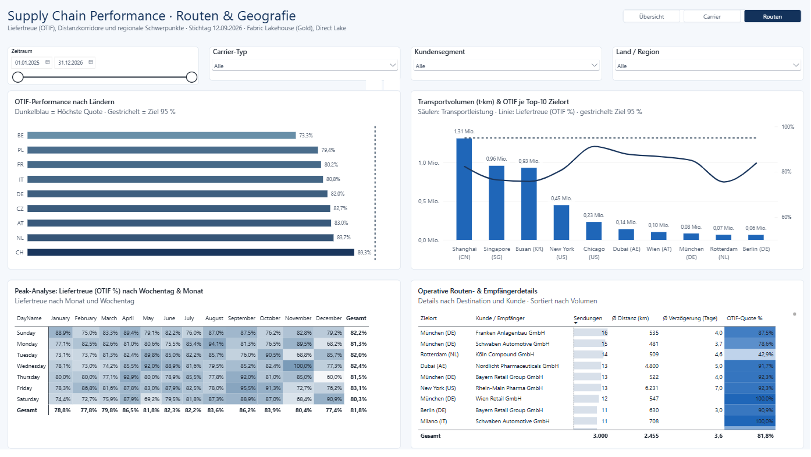

# Supply Chain Intelligence – Fabric End-to-End

*English summary: [README.en.md](README.en.md)*

Portfolio-Demoprojekt: Logistikdaten durchlaufen auf Microsoft Fabric eine Medallion-Architektur (Bronze, Silver, Gold), werden über ein Direct-Lake-Semantikmodell bereitgestellt und in einem Power-BI-Report mit drei Seiten ausgewertet.

Die Daten sind **synthetisch**. Das Projekt zeigt Vorgehen, Modellierung und Qualitätssicherung, keine Ergebnisse aus einem echten Unternehmen.

## Was das Projekt zeigt

- Ein Datenfluss von CSV-Rohdaten bis zum Report auf Fabric, entwickelt mit Azure DevOps als Quelle der Wahrheit (dieses Repository ist eine Momentaufnahme des Stands vom Oktober 2026).
- Ein Sternschema im Lakehouse und ein Direct-Lake-Modell darauf, mit Measures im Repo statt in der Web-Modellierung.
- Datenqualitätstests, die falsche Kennzahlen abfangen, bevor sie im Report landen.
- Ein Report mit festem Layoutraster und einem konsistenten Theme.

Was es **nicht** ist: ein produktives System. Es gibt keine automatische Bereitstellungspipeline, keine Pull-Request-Reviews und keine Lasttests. Aussagen zur Performance sind nicht gemessen. Der Data Agent ist ein Entwurf (nicht veröffentlicht, einmal getestet), die Fabric-Kapazität ist angehalten.

## Datenbasis

| | |
|---|---|
| Quelle | `data/generate_raw_data.py` erzeugt die CSV-Dateien in `data/raw/` (fester Seed 42) |
| Umfang | 3.000 Sendungen, 15 Carrier, 50 Kunden, 80 Materialien, 40 Routen |
| Zeitraum | Bestellungen 01/2025 bis 08/2026, Stichtag 12.09.2026 |
| Hauptkennzahl | OTIF-Quote = pünktlich zugestellte Sendungen / zugestellte Sendungen (aktuell 81,85 %), Ziel 95 % |

## Architektur

```text
data/raw/*.csv
      |  nb_bronze_ingestion       Rohdaten als Delta-Tabellen (bronze_*)
      v
Bronze
      |  nb_silver_transformation  Typisierung, Verspätung in Tagen, OTIF-Flag
      v
Silver (silver_*)
      |  nb_gold_transformation    Dimensionen, Faktentabelle, Datumsdimension
      v
Gold (Lakehouse lh_supplychain)
      |  Direct Lake
      v
Semantikmodell sm_supplychain_gold
      |  PBIR, byPath
      v
Report rp_supplychain_overview
```

Zusätzlich laufen zwei Notebooks als Qualitätsstufe:

- `nb_data_quality_tests` prüft Gold und Modell nach der Transformation (siehe unten).
- `nb_model_bpa` führt den Best Practice Analyzer auf dem Semantikmodell aus.

## Semantikmodell

- Tabellen: `fact_shipments`, `dim_carrier`, `dim_customer`, `dim_date`, `dim_material`, `dim_route`, dazu die Measure-Tabelle `_Measures` und die Berechnungsgruppe `CG_Metric_Switch` (Sendungsvolumen oder Transportleistung).
- Direct Lake: Das Modell liest die Delta-Tabellen aus OneLake, es gibt keinen Importlauf.
- Measures sind in `sm_supplychain_gold.SemanticModel/definition/tables/_Measures.tmdl` gepflegt. Gemeinsame Muster: Zielwert über `OTIF Ziel %`, Abweichung in Prozentpunkten über `OTIF Abweichung pp`, Farbsteuerung und dynamische Titel über eigene Measures.

## Report

Drei Seiten, 1920 x 1080, Theme `Mirza Data Supply Chain v2`. Das Layout folgt einem 24-Pixel-Raster mit vier Spalten à 450 px. Die Farbwahl und die Kennzahlendarstellung sind an IBCS angelehnt, ohne den Standard vollständig umzusetzen.

| Seite | Inhalt |
|---|---|
| Übersicht | KPI-Karten (OTIF-Quote, Verzögerung, Sendungen, Transportleistung), OTIF-Trend mit Zielwert 95 %, Liefertreue und Verspätungen nach Carrier-Typ und Kundensegment |
| Carrier | KPI-Karten (OTIF-Quote, bester und schwächster Carrier, Spreizung dazwischen), Ranking gegen Ziel, Risiko-Matrix, Carrier-Scorecard |
| Routen | OTIF nach Ländern, Transportvolumen je Zielort, Liefertreue nach Wochentag und Monat, Routen- und Empfängerdetails |

Screenshots aus dem Fabric-Workspace `ws-dev-analytics`:







Die Umbauten der Carrier-Seite stehen in [CARRIER_PAGE_REFACTORING.md](CARRIER_PAGE_REFACTORING.md).

## Datenqualität

`nb_data_quality_tests` prüft in fünf Schritten: referenzielle Integrität, einen Regressionstest der Verspätungslogik, Plausibilität von Mengen und Gewichten, den Abgleich der DAX-Kennzahlen im Modell über Semantic Link und eine Auswertung, die bei einem Fehlschlag mit Fehler abbricht.

Der Anlass ist ein echter Fehler aus der Entwicklung: Die Verspätungslogik hing an einem Status, 351 Sendungen bekamen dadurch weder Verspätung noch Flag, und der Report zeigte 176 statt 527 verspätete Sendungen, ohne dass etwas abstürzte. Der Regressionstest fängt genau das ab.

Ein zweites Beispiel aus der Weiterentwicklung: Am 30.09.2026 kamen beim Aufbau von `fact_shipments` im Gold-Notebook zwei aufeinanderfolgende Zeilen dazu, die beide `weight_kg` setzten. Die zweite überschrieb die erste mit `tonnen_km / 1000`, auf zwei Nachkommastellen gerundet. Bei 154 Sendungen blieb dadurch 0,00 stehen. Kein Visual und kein Measure benutzt `weight_kg`, der Report zeigte weiter richtige Zahlen, und ohne den Plausibilitätstest wäre der Fehler unbemerkt geblieben. Der Test brach mit „weight_kg vorhanden und > 0: 154 Zeilen leer oder <= 0“ ab, die beiden Zeilen wurden entfernt, danach standen alle 20 Tests wieder grün.

## KI-Schicht: Data Agent

Auf dem Semantikmodell sitzt ein Fabric Data Agent (`ag_supplychain`, Entwurf), mit dem Fragen zu Sendungen und Liefertreue in natürlicher Sprache gestellt werden können. Zehn Testfragen, Ergebnisse vor und nach den Agent-Anweisungen, die Anweisungen selbst und die Grenzen stehen in [docs/ki-agent-test.md](docs/ki-agent-test.md).

Kurz: Sieben von zehn Fragen waren ohne Anweisungen richtig. Der Agent hat „OTIF“ zunächst als „On Time In Full“ gedeutet und 2.376 pünktlich zugestellte Sendungen als „vollständig“ geliefert bezeichnet, obwohl das Modell nur Pünktlichkeit abbildet. Mit Anweisungen war das behoben. Eine Detailabfrage (verspätete Sendungen im Februar) lief danach in einen Timeout, der Agent hat das offen gesagt und nichts erfunden.


## Repository-Struktur

```text
data/                               Generator und synthetische Rohdaten
nb_bronze_ingestion.Notebook/       Bronze
nb_silver_transformation.Notebook/  Silver
nb_gold_transformation.Notebook/    Gold
nb_data_quality_tests.Notebook/     Datenqualitätstests
nb_model_bpa.Notebook/              Best Practice Analyzer
lh_supplychain.Lakehouse/           Lakehouse-Definition
ag_supplychain.DataAgent/           Fabric Data Agent (Entwurf)
sm_supplychain_gold.SemanticModel/  Semantikmodell (TMDL)
rp_supplychain_overview.Report/     Report (PBIR)
rp_supplychain_overview.pbip        Projektdatei für Power BI Desktop
docs/                               Screenshots und KI-Test (ki-agent-test.md)
CARRIER_PAGE_REFACTORING.md         Umbau der Carrier-Seite
CLAUDE.md                           Arbeitsregeln für das Projekt
```

## Arbeitsmodell: drei Kopien

Azure DevOps `main` ist die einzige Wahrheit. Der Fabric-Workspace `ws-dev-analytics` ist per Git-Integration daran gekoppelt, der lokale Clone per push und pull.

- Notebooks und Lakehouse werden in Fabric bearbeitet und dort committet.
- Report-Layout und Semantikmodell werden lokal bearbeitet, dann gepusht, dann in Fabric über „Alle aktualisieren“ übernommen.
- Power BI Desktop lädt das Direct-Lake-Modell aus Fabric. Ein neues Measure aus dem Repo ist in Desktop erst sichtbar, wenn es auf `main` liegt und Fabric aktualisiert hat.
- `sm_supplychain_gold.SemanticModel/definition/expressions.tmdl` enthält die Workspace- und Lakehouse-GUID der Direct-Lake-Bindung und wird nicht von Hand geändert.

Die vollständigen Regeln stehen in [CLAUDE.md](CLAUDE.md).

## Bereitstellung

1. Repository klonen:
   ```bash
   git clone https://github.com/Mirza0602/supply-chain-intelligence.git
   ```
2. Fabric-Workspace mit dem Branch `main` verbinden und unter Quellcodeverwaltung „Alle aktualisieren“ ausführen.
3. Die Notebooks nacheinander ausführen: `nb_bronze_ingestion`, `nb_silver_transformation`, `nb_gold_transformation`, danach `nb_data_quality_tests`.
4. `rp_supplychain_overview.pbip` in Power BI Desktop öffnen.

## Lizenz

MIT, siehe [LICENSE](LICENSE). Alle Daten sind synthetisch erzeugt (`data/generate_raw_data.py`). Ähnlichkeiten mit realen Unternehmen sind zufällig.
