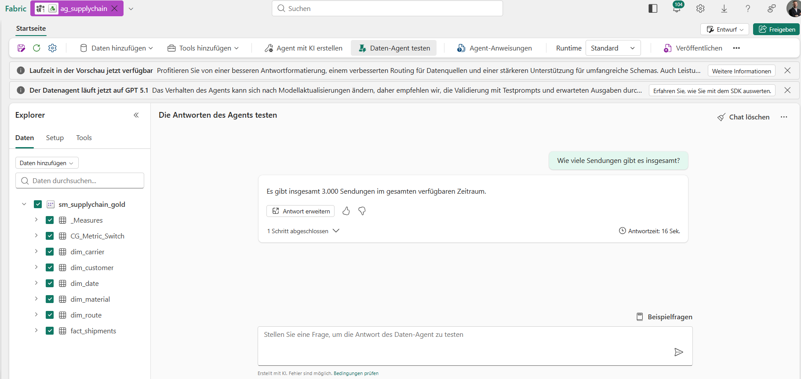
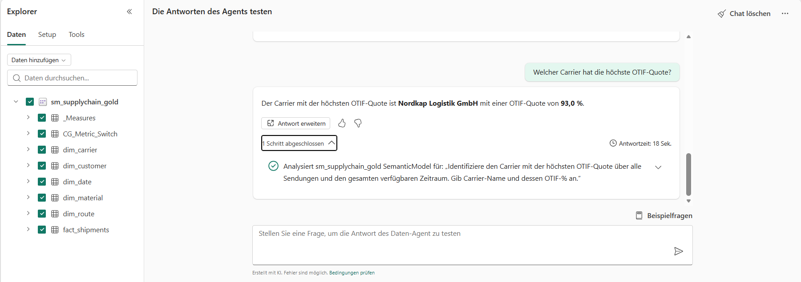
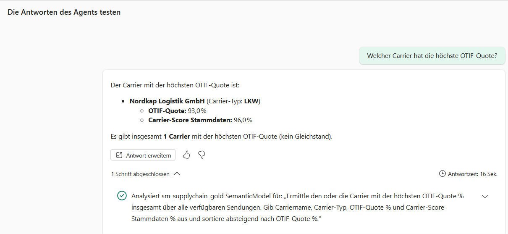
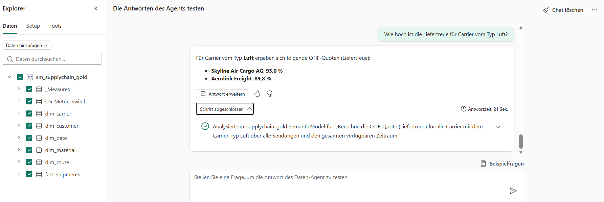
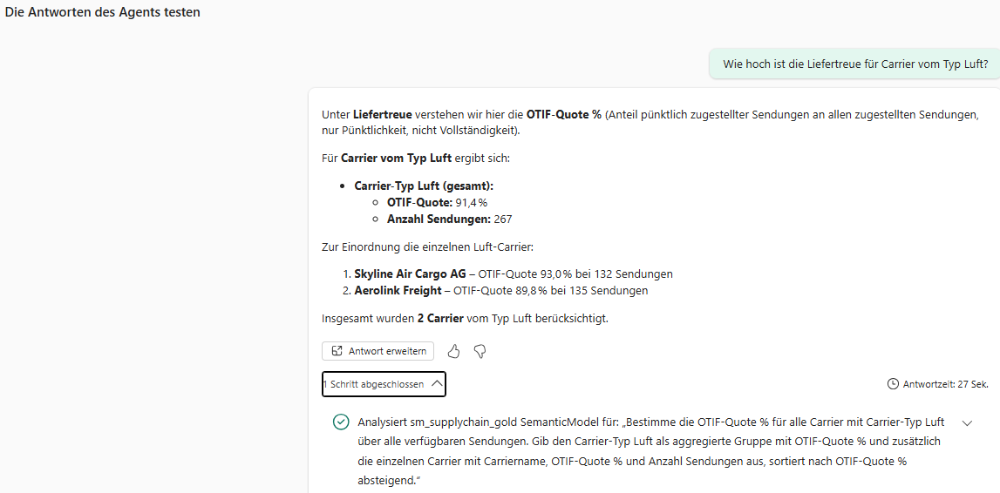
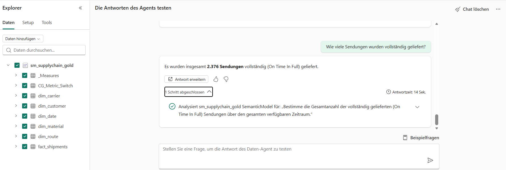
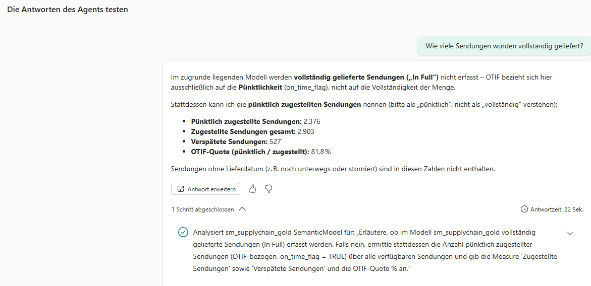
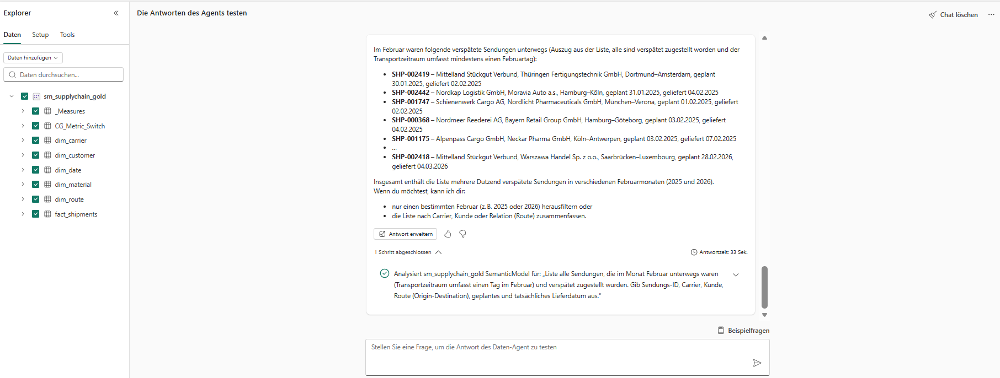
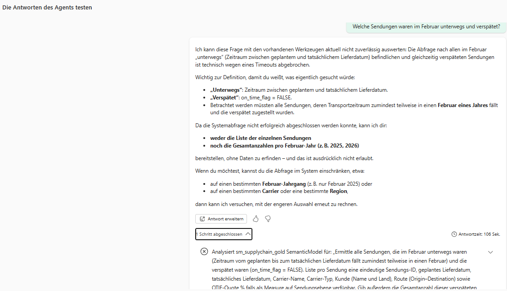

# KI-Schicht: Fabric Data Agent auf dem Semantikmodell

Stand: 5. Oktober 2026. Dieser Test zeigt, was ein Fabric Data Agent auf dem Modell `sm_supplychain_gold` leistet und wo er an Grenzen kommt. Die Daten sind synthetisch (3.000 Sendungen). Der Agent ist ein **Entwurf**, nicht veröffentlicht. Jede Frage wurde einmal gestellt, die Antworten eines Sprachmodells sind nicht deterministisch.

## Aufbau

| | |
|---|---|
| Agent | `ag_supplychain` (Fabric Data Agent, Standard-Runtime, laut Fabric-Hinweis auf GPT 5.1) |
| Datenquelle | Semantikmodell `sm_supplychain_gold`, alle 8 Tabellen |
| Kapazität | Fabric F2, Region Sweden Central |
| Vorbereitung | Beschreibungen für Tabellen, Spalten und Measures im Modell (TMDL, Commit `9a943f9`), danach Agent-Anweisungen (siehe unten) |



## Ergebnisse

Erwartete Werte stammen aus den Rohdaten und den Berichten, nicht vom Agenten.

| # | Frage | Erwartet | Antwort des Agenten | Bewertung |
|---|---|---|---|---|
| 1 | Wie viele Sendungen gibt es insgesamt? | 3.000 | 3.000 ([Bild](images/ki-agent/ki_02_sendungen_gesamt.png)) | richtig |
| 2 | Wie hoch ist die OTIF-Quote insgesamt? | 81,8 % | 81,8 % ([Bild](images/ki-agent/ki_03_otif_gesamt.png)) | richtig, der Agent deutet OTIF aber als „On Time In Full“ |
| 3 | Welcher Carrier hat die niedrigste OTIF-Quote? | Mediterra Container Lines, 65,7 % | Mediterra Container Lines, 65,7 % ([Bild](images/ki-agent/ki_04_niedrigste_otif.png)) | richtig |
| 4 | Welcher Carrier hat die höchste OTIF-Quote? | Nordkap Logistik GmbH, 93,0 % | siehe Vorher/Nachher | richtig |
| 5 | Wie viele Sendungen waren verspätet? | 527 | 527 ([Bild](images/ki-agent/ki_07_verspaetet.png)) | richtig |
| 6 | Durchschnittliche Verzögerung der verspäteten Sendungen? | 3,6 Tage | 3,6 Tage ([Bild](images/ki-agent/ki_08_verzoegerung.png)) | richtig |
| 7 | Welches Kundensegment hat die meisten verspäteten Sendungen? | Industrie, 218 | Industrie, 218 ([Bild](images/ki-agent/ki_09_kundensegment.png)) | richtig |
| 8 | Liefertreue für Carrier vom Typ Luft? | 91,4 % | siehe Vorher/Nachher | erst nach den Anweisungen vollständig |
| 9 | Wie viele Sendungen wurden vollständig geliefert? | nicht erfasst | siehe Vorher/Nachher | erst nach den Anweisungen richtig |
| 10 | Welche Sendungen waren im Februar unterwegs und verspätet? | 64 Sendungen (24 in 2025, 40 in 2026) | siehe Vorher/Nachher | nach den Anweisungen Timeout |

Die Antwortzeiten lagen bei den einfachen Fragen zwischen 9 und 21 Sekunden. Jede Antwort bestand aus einem Schritt, der im Agenten aufklappbar ist und die formulierte Abfrage zeigt.

## Vorher und nachher

### Frage 4: höchste OTIF-Quote
Vorher nannte der Agent nur den Carrier. Nachher nennt er zusätzlich Typ und Stammdaten-Score und sagt ausdrücklich „kein Gleichstand“. Das stimmt: Nordkap liegt bei 93,03 %, Skyline Air Cargo bei 92,97 %. Beide erscheinen im Bericht gerundet als 93,0 %. Meine eigene Erwartung („beide 93,0 %“) war hier ungenauer als der Agent.

| Vorher | Nachher |
|---|---|
|  |  |

### Frage 8: Liefertreue für Carrier vom Typ Luft
Vorher kamen nur die beiden Einzelwerte (Skyline 93,0 %, Aerolink 89,8 %), nicht die Quote für den Typ. Nachher steht zuerst der Wert der Gruppe (91,4 % bei 267 Sendungen), danach die Einzelwerte. Der Gruppenwert entspricht der Nachrechnung aus den Rohdaten (91,37 % auf den 255 zugestellten Sendungen).

| Vorher | Nachher |
|---|---|
|  |  |

### Frage 9: „vollständig“ geliefert
Das Modell bildet nur Pünktlichkeit ab, die Vollständigkeit einer Lieferung wird nicht erfasst, trotz des Namens OTIF. Vorher antwortete der Agent „2.376 Sendungen vollständig (On Time In Full)“. Die Zahl ist die der pünktlich zugestellten Sendungen, das Etikett war falsch. Das war die wichtigste Fehlerquelle des Tests: Der Agent hat die Beschreibung im Modell („nur Pünktlichkeit“) nicht beachtet. Nachher sagt er, dass „In Full“ nicht erfasst wird, und nennt 2.376 ausdrücklich als „pünktlich zugestellt“, daneben 2.903 zugestellt, 527 verspätet und 81,8 %.

| Vorher | Nachher |
|---|---|
|  |  |

### Frage 10: im Februar unterwegs und verspätet
Vorher lieferte der Agent nach 33 Sekunden einen Auszug mit sechs Sendungen und „mehrere Dutzend“, ohne Zahl und ohne seine Deutung von „unterwegs“ zu nennen. Die genannten Sendungen stimmen mit den Rohdaten überein. Nachher, mit Anweisungen, die Gesamtzahlen je Jahr und die vollständige Liste mit vielen Spalten verlangen, bricht die Abfrage nach 106 Sekunden mit einem Timeout ab. Der Agent erklärt das offen und erfindet nichts, liefert aber auch keine Zahl.

| Vorher | Nachher |
|---|---|
|  |  |

## Agent-Anweisungen
Diese Anweisungen wurden im Agenten hinterlegt (Fabric speichert sie im Agent-Item). Zum Zeitpunkt des Commits des Agenten in Git (`ag_supplychain.DataAgent`) standen sie noch nicht in der Konfiguration (`aiInstructions: null`), deshalb stehen sie hier.

```text
Du beantwortest Fragen zu Sendungen, Liefertreue und Transportleistung auf Basis des Semantikmodells sm_supplychain_gold. Antworte auf Deutsch, Zahlen im deutschen Format.

Definitionen:
- OTIF bedeutet in diesem Modell nur Pünktlichkeit: Anteil pünktlich zugestellter Sendungen an den zugestellten Sendungen (on_time_flag). Die Vollständigkeit der Lieferung (In Full) wird nicht erfasst. Fragt jemand nach vollständig gelieferten Sendungen, sage klar, dass das nicht erfasst wird. Nenne dann ersatzweise die pünktlich zugestellten Sendungen und kennzeichne sie als pünktlich, nicht als vollständig.
- Verspätet heißt on_time_flag = FALSE. Sendungen ohne Lieferdatum (In Transit, Cancelled) zählen weder als pünktlich noch als verspätet.

Regeln:
- Nutze für Kennzahlen immer die vorhandenen Measures (OTIF-Quote %, Verspätete Sendungen, Ø Verzögerung Tage, Gesamt Tonnen-km, Anzahl Sendungen) und rechne nichts selbst nach.
- Fragt jemand nach der Liefertreue einer Gruppe (z. B. Carrier-Typ, Kundensegment), nenne zuerst den Wert der Gruppe und danach, falls hilfreich, die Einzelwerte.
- Bei Gleichstand nenne alle gleichplatzierten Einträge.
- Bei Fragen zu einem Monat ohne Jahr: nenne die Werte je Jahr (2025 und 2026). Sage immer, wie du "unterwegs" verstanden hast (Zeitraum von geplantem bis tatsächlichem Lieferdatum).
- Nenne bei Listen immer die Gesamtzahl der Treffer.
```

## Was der Test zeigt
- **Beschreibungen im Modell reichen nicht.** Der Agent hat die Aussage „OTIF bedeutet hier nur Pünktlichkeit“ aus den Modellbeschreibungen ignoriert und erst mit expliziten Anweisungen richtig reagiert.
- **Sauber definierte Measures zahlen sich aus.** Die Standardfragen zu OTIF-Quote, Verspätungen, Verzögerung und Kundensegment waren ohne Anweisungen richtig, weil die Logik im Modell steckt und nicht im Agenten.
- **Anweisungen können eine Frage teurer machen.** Die Forderung nach Jahresaufteilung und kompletter Liste hat die Februar-Frage von „Auszug in 33 Sekunden“ auf „Timeout“ gebracht.
- **Der Agent erfindet bei einem Timeout nichts.** Das ist für eine Datenauswertung die richtige Haltung.
- **Die Prüfung der Erwartung gehört dazu.** Bei Frage 4 war der Agent genauer als die gerundete Anzeige im Bericht.

## Grenzen und Offenes
- Pro Frage nur ein Lauf, keine automatische Auswertung (etwa über das Fabric-SDK). Ergebnisse können bei einer Wiederholung abweichen.
- Die zuletzt geplante Anpassung der Anweisungen (bei Listenfragen nur Gesamtzahl und höchstens zehn Beispielzeilen) wurde nicht mehr getestet.
- Der Agent ist als Entwurf angelegt und nicht veröffentlicht. Es gab keinen Test mit Copilot Studio, Foundry oder M365 Copilot.
- Die Kapazität wurde nach dem Test angehalten. Eine Fabric-Kapazität verursacht auch ohne Nutzung Kosten, solange sie läuft. Wer das Projekt nachbaut, sollte sie nach der Arbeit pausieren oder löschen.
